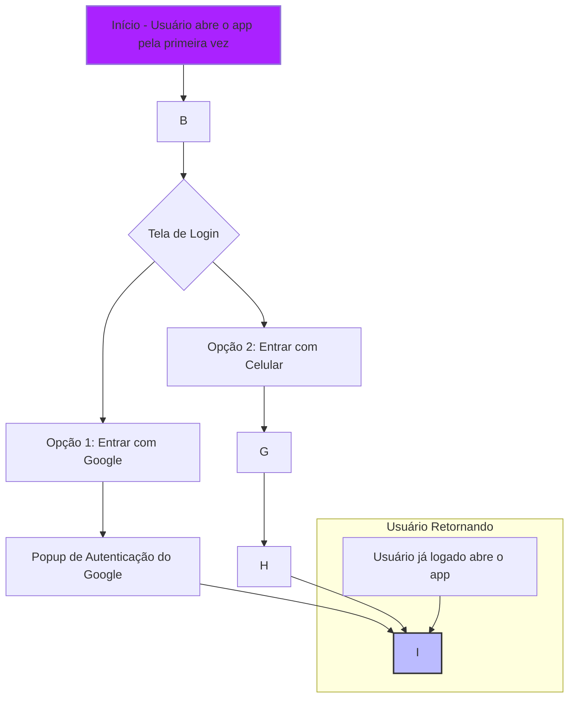
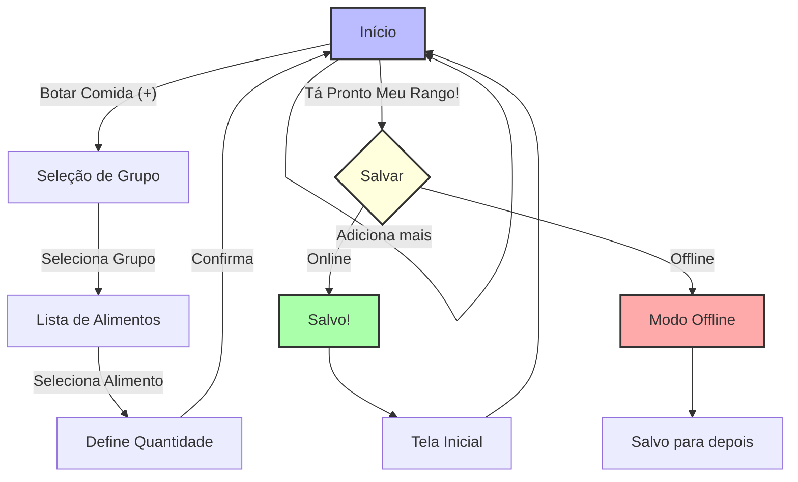
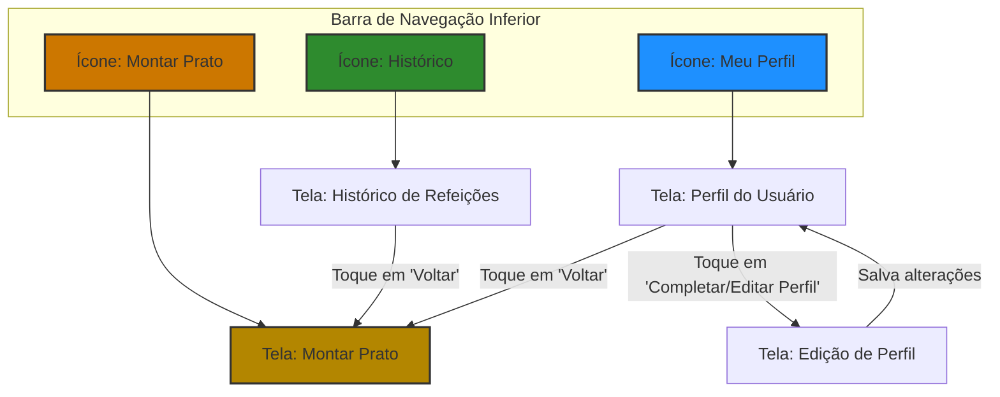

# Fluxograma de Navegação — DICUMÊ

Criado por: Vinícius Schneider
Criado em: 17 de junho de 2025 16:28
Categoria: APP, Android, IOS
Última edição por: Vinícius Schneider
Última atualização em: 17 de junho de 2025 18:59

Este documento descreve visualmente os principais caminhos de navegação do usuário dentro do aplicativo DICUMÊ, focando nas funcionalidades do MVP. O objetivo é ilustrar a jornada desde o primeiro acesso até a conclusão das tarefas centrais, como o registro de uma refeição, de forma clara e sequencial.

---

### **1. Fluxo de Primeiro Acesso e Autenticação**

*Este fluxo descreve a jornada de um novo usuário, desde a abertura do app pela primeira vez até o acesso à tela principal.*

Snippet de código

# 

### **2. Fluxo Principal - Registrar uma Refeição**

*Este é o fluxo central do aplicativo, detalhando como o usuário monta e salva seu prato.*

Snippet de código

# 

### **3. Fluxo de Visualização do Histórico e Perfil**

*Este fluxo mostra como o usuário acessa as telas secundárias a partir da barra de navegação inferior.*

Snippet de código

# 

